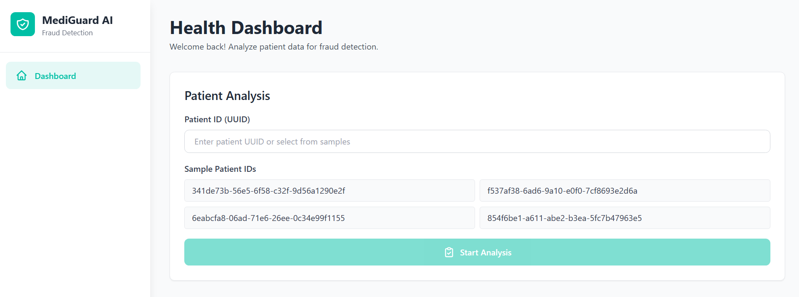

# MediGuard AI - Healthcare Fraud Detection System

A multi-agent AI system for healthcare fraud detection and discharge management using LangGraph and Google Gemini 2.5. This system analyzes patient data to detect identity misuse, billing fraud, and discharge blockers.



## 🎯 Features

- **Agent 1: Identity & Claims Fraud Detection** - Detects fake claims and identity misuse
- **Agent 2: Billing Fraud Analysis** - Identifies inflated or unnecessary billing items
- **Agent 3: Discharge Blockers Assessment** - Determines what's preventing patient discharge
- **Modern Web Interface** - Clean Next.js frontend with real-time workflow visualization
- **Synthea Data Support** - Works with synthetic healthcare data from Synthea

## 📋 Prerequisites

- **Python 3.9+**
- **Node.js 18+** and npm
- **Google Gemini API Key** - Get one from [Google AI Studio](https://makersuite.google.com/app/apikey)

## 🚀 Quick Start

### 1. Clone the Repository

```bash
git clone <repository-url>
cd mediguard-ai
```

### 2. Backend Setup

```bash
# Install Python dependencies
pip install -r requirements.txt

# Create .env file
cp .env.example .env
# Edit .env and add your Google API key:
# GOOGLE_API_KEY=your_api_key_here
```

### 3. Frontend Setup

```bash
cd frontend

# Install dependencies
npm install

# (Optional) Create .env.local for custom backend URL
# PYTHON_API_URL=http://localhost:8000
```

### 4. Run the Application

**Terminal 1 - Start Backend:**
```bash
python api_server.py
```
Backend will run on `http://localhost:8000`

**Terminal 2 - Start Frontend:**
```bash
cd frontend
npm run dev
```
Frontend will run on `http://localhost:3000`

### 5. Access the Application

Open your browser and navigate to `http://localhost:3000`

## 📁 Project Structure

```
mediguard-ai/
├── main.py                 # Core LangGraph workflow and agents
├── api_server.py           # FastAPI backend server
├── requirements.txt        # Python dependencies
├── data1/                  # Synthea data files (patients, claims, claim_lines)
├── frontend/               # Next.js frontend application
│   ├── app/               # Next.js app router pages
│   ├── components/        # React components
│   └── package.json       # Frontend dependencies
└── docs/                  # Documentation
    ├── BACKEND.md         # Backend function documentation
    ├── FRONTEND.md        # Frontend component documentation
    └── synthea-data-mapping.md
```

## 🔧 Configuration

### Environment Variables

**Backend (.env):**
```
GOOGLE_API_KEY=your_google_gemini_api_key
```

**Frontend (.env.local):**
```
PYTHON_API_URL=http://localhost:8000
```

## 📊 Data Requirements

The system expects Synthea-generated CSV files in the `data1/` folder:

- `patients.csv` - Patient demographics (Id, SSN, DOB, name, address, etc.)
- `claims.csv` - Claim-level data (claim_id, patient_id, diagnosis, costs, dates)
- `claim_lines.csv` - Detailed billing line items (procedure codes, charges)

See `docs/synthea-data-mapping.md` for detailed data structure requirements.

## 🧪 Testing

### Test with Sample Patient ID

1. Start both backend and frontend servers
2. Open the frontend at `http://localhost:3000`
3. Enter a patient UUID (e.g., `341de73b-56e5-6f58-c32f-9d56a1290e2f`)
4. Click "Start Analysis" to run all three agents

### Get Sample Patient IDs

The frontend will show sample patient IDs when you run it without arguments, or you can query:
```bash
curl http://localhost:8000/api/sample-ids
```

## 📚 Documentation

- **[Backend Documentation](docs/BACKEND.md)** - Detailed explanation of all backend functions
- **[Frontend Documentation](docs/FRONTEND.md)** - Component and function documentation
- **[Synthea Data Mapping](docs/synthea-data-mapping.md)** - Data structure requirements

## 🛠️ Development

### Backend Development

```bash
# Run backend in development mode
python api_server.py

# Test individual agent
python main.py <patient_id>
```

### Frontend Development

```bash
cd frontend
npm run dev      # Development server
npm run build    # Production build
npm run start    # Production server
```

## 🔍 API Endpoints

### Backend API (Port 8000)

- `GET /` - API information
- `GET /api/sample-ids?limit=10` - Get sample patient IDs
- `POST /api/analyze` - Run full analysis (all agents)
  ```json
  {
    "patient_id": "uuid-here"
  }
  ```
- `POST /api/analyze/agent1` - Run only Agent 1
- `GET /health` - Health check

### Frontend API Routes (Port 3000)

- `POST /api/analyze` - Proxy to backend analysis
- `GET /api/sample-ids` - Proxy to backend sample IDs

## 🐛 Troubleshooting

**Backend not starting:**
- Check that Python 3.9+ is installed
- Verify all dependencies are installed: `pip install -r requirements.txt`
- Ensure `.env` file exists with `GOOGLE_API_KEY`

**Frontend not connecting to backend:**
- Verify backend is running on port 8000
- Check `PYTHON_API_URL` in frontend `.env.local`
- Check browser console for CORS errors

**Patient ID not found:**
- Verify patient ID exists in `data1/patients.csv`
- Check that CSV files are in the correct location
- Ensure patient IDs are UUIDs, not simple IDs

**Analysis errors:**
- Check backend logs for detailed error messages
- Verify Google API key is valid and has quota
- Ensure data files are properly formatted

## 📝 License

This project is part of an AI Agents capstone project.

## 🤝 Contributing

This is a capstone project. For questions or issues, please refer to the documentation or contact the project maintainers.

## 🙏 Acknowledgments

- Built with [LangGraph](https://github.com/langchain-ai/langgraph)
- Uses [Google Gemini 2.5](https://ai.google.dev/) for AI analysis
- Frontend built with [Next.js](https://nextjs.org/) and [Tailwind CSS](https://tailwindcss.com/)
- Data generated using [Synthea](https://github.com/synthetichealth/synthea)
